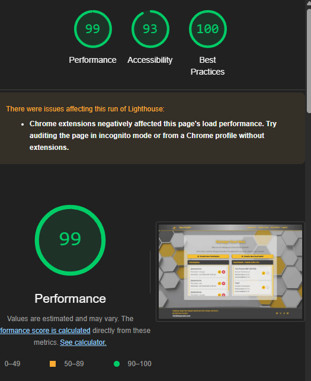

# Bee Pocket

The repository for my Code Institute Bootcamp capstone project, after 14 weeks of learning HTML, CSS, JS and Python.

## Table of Contents

1. [Project Overview](#project-overview)
2. [Technologies Used](#technologies-used)
3. [Project Aims](#project-aims)
4. [User Roles/Personas](#user-rolespersonas)
5. [User Stories](#user-stories)
6. [User Experience Design](#user-experience-design)
    - [Landing Page](#landing-page)
    - [Admin Page](#admin-page)
    - [Create Page](#create-page)
    - [Pocket Page](#pocket-page)
7. [Creative Design Decisions](#creative-design-decisions)
8. [Database Design](#database-design)
9. [Application Breakdown](#application-breakdown)
    - [admin_app](#admin_app)
    - [landing](#landing)
    - [create_app](#create_app)
    - [pocket_app](#pocket_app)
10. [Features](#features)
11. [Agile Methodology](#agile-methodology)
12. [Project Board](#project-board)
13. [Testing](#testing)
    - [Initial Testing](#initial-testing)
      - [Lighthouse Report](#lighthouse-report)
         - [Mobile](#mobile)
         - [Desktop](#desktop)
      - [CSS Testing (W3C)](#css-testing-w3c)
      - [HTML Testing (W3C)](#html-testing-w3c)
14. [Deployment](#deployment)
    - [Real-Time Testing/Alerts](#real-time-testingalerts)
15. [Use of AI](#use-of-ai)
16. [Future Enhancements](#future-enhancements)
17. [Credits](#credits)

## Project Overview

Bee Pocket is a web application designed to help families manage pocket money, tasks, behaviors, and rewards. It provides a centralized platform for parents or guardians to create and track tasks, assign consequences or rewards, and manage virtual "BeePockets" for their children.

## Technologies Used

*   **Python**: The primary programming language.
*   **Django**: A high-level Python web framework used for building the application.
*   **HTML**: Used for structuring the web pages.
*   **CSS**: Used for styling the web pages.
*   **JavaScript**: Used for adding interactivity to the web pages.
*   **Bootstrap**: A CSS framework used for creating responsive and mobile-first web pages.
*   **django-allauth**: A Django library used for handling user authentication, registration, and social authentication.
*   **psycopg2**: A PostgreSQL adapter for Python.
*   **Whitenoise**: A library for serving static files in Django.
*   **gunicorn**: A WSGI server for deploying the Django application.
*   **python-decouple**: Used to manage settings in Django projects.
*   **Material Icons**: Used to add icons to the web pages.

## Project Aims

The primary aims of this project are to:

*   Provide a user-friendly interface for managing pocket money and related activities.
*   Enable parents/guardians to easily create and assign tasks, consequences, and rewards.
*   Offer a virtual "BeePocket" system for tracking balances and transactions.
*   Implement user authentication and authorization for secure access.
*   Create a responsive and accessible web application.

## User Roles/Personas

The application is designed around 3 user roles:

*   **Account-Admin**: A super-user class who can manage the 'bee-pockets' and assign delegated user roles within their family.
*   **Bee-Pocket Admin**: A user role, for a parent to create and assign items to their kids 'bee-pockets' clearly articulating tasks, consequences and rewards.
*   **Bee-Pocket User**: A user role, for a kid to view their own 'bee-pocket' balance and the details of the assigned items within that pocket.

## User Stories

1. [MUST HAVE] As an account admin I want to be able to add user roles and permissions so that everyone can make use of the application
    * Criteria 1 - The super user can add other users to their top level account
    * Criteria 2 - Users can hav emultiple roles across different bee pockets
    * Criteria 3 - The super user can view/edit/delete the existing permissions on their account

2. [MUST HAVE] As an account admin, I want to be able to create new pockets, so that users can start earning rewards
    * Criteria 1 - The account-admin can create pockets through their page
    * Criteria 2 - The account-admin can update pockets through their page
    * Criteria 3 - The account-admin can delete pockets through their page

3. [MUST HAVE] As a pocket manager, I want to create an activity item, so that the end user is aware of their goals
    * Criteria 1 - The pocket manager has their own page to CRUD items
    * Criteria 2 - Items can be created by pocket managers
    * Criteria 3 - Created items can be edited/deleted by their creator or another pocket manager.

4. [MUST HAVE] As a pocket manager, I want to assign an item to a pocket, so that tasks can be distributed.
    * Criteria 1 - A pocket manager can take an exiting item and create an instance of that item to a pocket
    * Criteria 2 - The pocket manager can mark an item instance as completed or disable/delete it.

5. [MUST HAVE] As a pocket user/owner I want to see all instances assigned to my pocket, so that I know what I have to do/have done
    * Criteria 1 - Through my own pocket page, I can see all my instances
    * Criteria 2 - I can apply a filter for those which have been completed/are available
    * Criteria 3 - I can clearly see the difference between tasks, consequences and rewards

6. [MUST HAVE] As a pocket user/owner, I want to see my current balance, so that I understand what I have to redeem for rewards
    * Criteria 1 - The pocket page shows a current balance

7. [SHOULD HAVE] As a user or manager of a pocket, I want to be able to leave comments, so that feedback and updates can be shared
    * Criteria 1 - Any instance within a pocket can have comments left by users and managers of that pocket
    * Criteria 2 - Individuals can edit/delete their own comments
    * Criteria 3 - Managers can delete user comments

8. [COULD HAVE] As a pocket manager, I want item instances I have chosen to be created automatically, so I dont have to do this myself
    * Criteria 1 - A pocket manager can set the repeatability of an item
    * Criteria 2 - The backend creates these instances automatically

9. [COULD HAVE] As a user I want to be able to signup/signin using existing social media accounts, so that I dont have to remember another password
    * Criteria 1 - Users can sign up/in with Google
    * Criteria 2 - Users can sign up/in with Github

## User Experience Design

The user experience design focuses on creating an intuitive and engaging interface for both parents and children. Key design principles include:

*   **Ease of Use**: Simple navigation and clear instructions for managing tasks and rewards.
*   **Feedback**: All users receive notifications when actions they have taken have been successful.
*   **Responsiveness**: Ensuring the application works seamlessly on both desktop and mobile devices.
*   **Accessibility**: Making the application accessible to users with disabilities by following web accessibility guidelines.
*   **Visual Appeal**: Using a clean and modern design with engaging visuals and icons.

Wireframe mockups were drawn on ReMarkable to give design direction.

### Landing Page

### Admin Page

### Create Page

### Pocket Page

## Creative Design Decisions

The theme of the project is unsurprisingly bees, the language aligns with this (honey, hive, buzz etc.)

The colour-scheme was selected to reflect this, with the primary colour of yellow, a secondary dark gray and some lighter shades of gray for highlights and to act as a background for the secondary coloured text.

Contrast of the primary/secondary was suitable for accesibility.

Fonts were selected from Google Fonts, a primary font in keeping with the friendly, natural and cartoonish nature of the theme, with a clear, readable secondary font.

Bootstrap elements were used for convenience & Google Material Design icons were chosen due to their simplicity and as they represent a common standard in user experience.

## DataBase Design

The design and interaction of the models was done prior to coding in anger.

## Application Breakdown

The project is structured into several Django apps, each serving a specific purpose and aligned with the user roles above:

The final pages reflect the UX goals of the wireframes, if not being exact carbon copies, this reflects the focus being on delivery of the functionality required in the user-stories and the broad project design principles.

### admin\_app

*   **Purpose**: Manages user accounts, BeePockets, and user permissions. Account-Admins can create and manage accounts, assign permissions to users for accessing specific BeePockets.
*   **Models**:
    *   `User`: Custom user model extending Django's AbstractBaseUser.
    *   `Account`: Represents a family account managed by a superuser.
    *   `BeePocket`: Represents a virtual pocket money account.
    *   `UserPermission`: Defines permissions for users to access BeePockets.

    

### landing

*   **Purpose**: Handles the landing page for the application, specifically for unregistered users. Displays marketing content to unauthenticated users and redirects authenticated users to their appropriate dashboard.
*   **Views**:
    *   `landing_page`: Renders the landing page based on user authentication status.

### create\_app

*   **Purpose**: Manages the creation, editing, and deletion of items (tasks, consequences, rewards) and item instances (specific transactions) by a Bee-Pocket Admin.
*   **Models**:
    *   `Item`: Represents a template for a transaction (e.g., "Clean your room").
    *   `Category`: Represents a category for an item (e.g., "Chores").
*   **Views**:
    *   `create_item`: Creates new items.
    *   `create_item_instance`: Creates new item instances.
    *   `item_instances`: Returns item instances for a given BeePocket.
    *   `approve_item_instance`: Approves an item instance.
    *   `edit_item`: Edits an existing item.
    *   `delete_item`: Deletes an existing item.
    *   `edit_item_instance`: Edits an existing item instance.
    *   `delete_item_instance`: Deletes an existing item instance.

    

### pocket\_app

*   **Purpose**: Provides the Bee-Pocket User dashboard for managing BeePockets and viewing item instances.
*   **Models**:
    *   `ItemInstance`: Represents a specific transaction in a BeePocket.
    *   `Comment`: Represents a comment on an item instance.
*   **Views**:
    *   `userpage`: Renders the user dashboard, displaying BeePockets, item instances, and balances.
    *   `item_detail`: Displays details for a specific item instance and allows users to add comments.

    

## Features

*   User authentication and registration using django-allauth.
*   Account management by superusers.
*   Creation and management of BeePockets.
*   Assignment of user permissions for BeePocket access.
*   Creation and management of items (tasks, consequences, rewards).
*   Creation and management of item instances (transactions).
*   User dashboard for viewing BeePockets, balances, and item instances.
*   Commenting on item instances.
*   Responsive design for mobile and desktop devices.

## Agile Methodology

The project follows Agile methodology to ensure iterative development and continuous improvement. Key practices include:

*   **User Stories**: User stories are short, simple descriptions of a feature told from the perspective of the person who desires the new capability. They typically follow the format: "As a [type of user], I want [an action] so that [a benefit/a value]." User stories help to ensure that the development team understands the requirements from the user's perspective, promoting user-centric design and development. They also facilitate clear communication between stakeholders and the development team, ensuring that the final product meets user needs and expectations.
*   **Project Board**: See Below

## Project Board

The project board on GitHub is used to track tasks and progress. It includes columns for:

*   **Backlog**: List of tasks to be completed, bugs identified and features to be added.
*   **To Do**: The active tasks for the current development cycle - akin to a sprint plan.
*   **In Progress**: Tasks currently being worked on.
*   **Done**: Tasks that are completed and approved.

You can view the project board [here](https://github.com/users/joe-aswonvos/projects/6/views/1).

## Testing

Testing is an integral part of the development process to ensure the application works as expected. Key testing practices include:

*   **Unit Testing**: Testing individual components and functions - this was conducted throughout development, to ensure everything worked, before moving onto the next user story.
*   **Integration Testing**: Testing the interaction between different components.
*   **Automated Testing**: Using tools to automate repetitive testing tasks. A number of straightforward automated tests of the CRUD functionality have been set up with the assistance of Copilot, to ensure that the appropriate records can be created, edited and deleted, in line with the functional views undertaking these actions.

### Initial Testing

#### Lighthouse Report

Lighthouse testing of performance, accessibility and best practice have been performed for both Mobile and Desktop, as this is the MVP of the project, the goal is to have no major issues on performance, accesibility or best practice:

##### Mobile

While not as fast to render as on the desktop, the scores are acceptable.

##### Desktop

The site loads quickly on desktop with acceptable scores.

#### CSS Testing (W3C)

I hadn't anticipated any issues with the code testing, however the CSS report highlighted a typo, with an inadvertant space in font-family: var(--secondary -font); which was a straightforward fix

#### HTML Testing (W3C)

On testing a couple of issues identified with rogue syntax elements, some duplicated "'s, this is likely due to the lack of an appropriate Django linting plugin in VS Code - I've been testing the use of the PyCharm IDE for future Django projects as it appears to offer more 'out of the box' support.

## Deployment

The application is deployed on Heroku [here](https://joe-aswonvos-bee-pockets-74257bdea064.herokuapp.com/myaccount/1/):

* Data is held on a postgreSQL server hosted by Code-Institute
* The repository is held on GitHub and Heroku deploys the latest version of the main branch
* Heroku settings contain all the relevant secret keys for the project to remain secure.

### Real-Time Testing/Alerts

To monitor the deployed application, Sentry was integrated as an error tracking and performance monitoring tool. Sentry provides real-time insights into application issues, such as unhandled exceptions, slow database queries, and performance bottlenecks. By capturing detailed error logs and stack traces, it allows for quick identification and resolution of problems, ensuring a smoother user experience. Additionally, Sentry's alerting system notifies the development team of critical issues, enabling proactive maintenance and minimizing downtime.

## Use of AI

Throughout the development process, GitHub Copilot was utilized to assist in writing and testing code. Copilot provided code suggestions and snippets, which were carefully reviewed and understood before being integrated into the project. This ensured that the code met the project's requirements and maintained high quality.

Additionally, images and backgrounds used in the project were created using Microsoft Copilot and Leonardo.ai. These tools helped generate visually appealing and thematically consistent assets, enhancing the overall user experience.

AI represents a powerful weapon in the armoury of a developer, enabling dialogue to query code, understand error messages and find out why stuff isn't working. It's also been very helpful in the creation of the python tests of CRUD functionality, where it can be pointed at a given view and asked to write a test to check whether the view functions correctly, I didn't find any issues in the AI's interpretation of the views for testing, this is probably because the views themselves were kept straigtforward and functional.

## Future Enhancements

*   Implement automatic generation of item instances based on repeatability settings.
*   Add support for recurring transactions.
*   Implement a notification system for new tasks, consequences, and rewards on login.
*   Enhance the user interface with more interactive elements.
*   Add more detailed reporting and analytics.
*   Implement a mobile app version.

## Credits

*   [Code Institute](https://codeinstitute.net) - For providing the educational foundation and resources for this project.
*   [django-allauth](https://django-allauth.readthedocs.io/en/latest/) - For simplifying user authentication and social authentication.
*   [Bootstrap](https://getbootstrap.com) - For providing a responsive and mobile-first CSS framework.
*   All other libraries and technologies mentioned above.